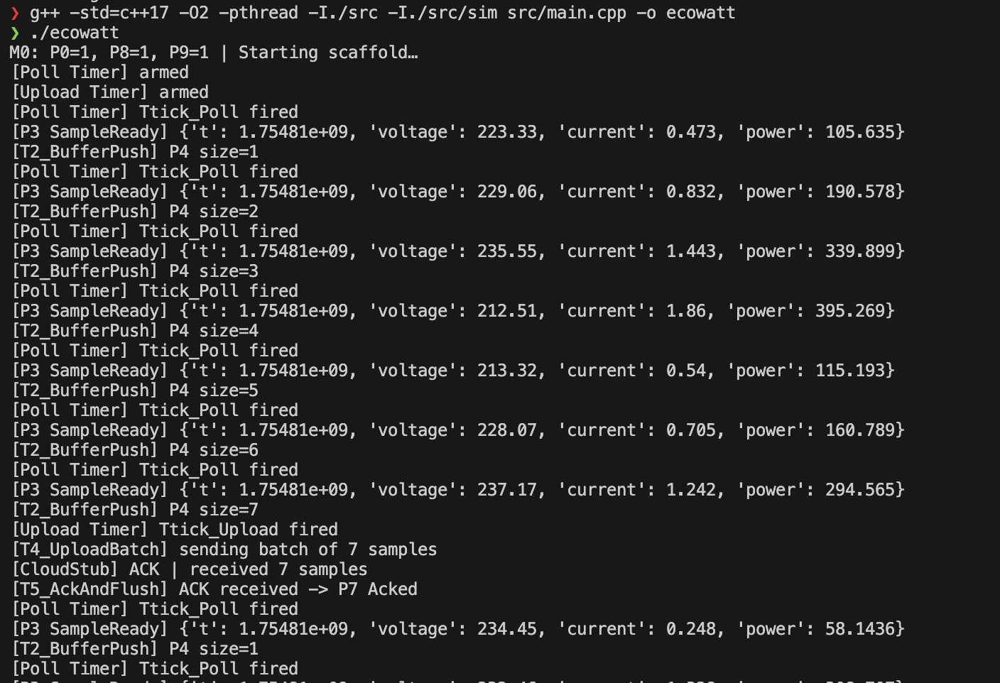

# EcoWatt Milestone 1 – Petri Net Model & Scaffold Implementation

This repository contains the **Milestone 1** deliverable for the EcoWatt project, featuring:

- **Petri Net system model** for periodic polling, buffering, and periodic upload
- **Python scaffold implementation** simulating device logic, inverter communication, and cloud connectivity
- **C++ scaffold implementation** with identical Petri Net mapping, ready for embedded or desktop builds

---

## 📋 Overview

The system models a device that performs the following operations:

1. **Periodically polls** an inverter for voltage and current readings
2. **Buffers readings** locally using a bounded buffer
3. **Uploads** all buffered samples to the cloud every 15 seconds (simulated; 15 minutes in real device)
4. **Clears buffer** upon cloud acknowledgment
5. **Handles transient faults** such as inverter unavailability and cloud NACK responses

The Petri Net model verifies correctness before implementing the scaffolds in both Python and C++.

---

## 📈 Petri Net Model

### Places (P)
- **P0** - Idle  
- **P1** - PollTimerReady  
- **P2** - Polling  
- **P3** - SampleReady  
- **P4** - Buffer [capacity=N]  
- **P5** - UploadTimerReady  
- **P6** - Uploading  
- **P7** - Acked  
- **P8** - PollTimerArmed  
- **P9** - UploadTimerArmed  

### Transitions (T)
- **T0** - ArmPollTimer  
- **Ttick_Poll** - Timed transition (poll period)  
- **T1** - DoPoll `{SIM_OK}`  
- **T2** - BufferPush `{BUF_HAS_SPACE}`  
- **T3** - ArmUploadTimer  
- **Ttick_Upload** - Timed transition (upload period)  
- **T4** - UploadBatch `{BUF_NOT_EMPTY}`  
- **T5** - AckAndFlush  

### Model Properties
The Petri Net ensures:
- **Boundedness** – Buffer never exceeds defined capacity
- **Liveness** – With SIM & network operational, all buffered samples are eventually uploaded
- **Safety** – Guards prevent invalid state transitions

---

## 🗂 Project Structure

```
Milestone1/
├── Python/
│   ├── app.py                    # Main application runner
│   ├── core/
│   │   ├── timers.py            # Periodic timers (poll/upload)
│   │   ├── acquisition.py       # Poll inverter + push to buffer
│   │   ├── buffer.py            # Bounded buffer (ring queue)
│   │   └── uploader.py          # Upload to cloud + ACK handling
│   ├── sim/
│   │   ├── inverter_sim.py      # Simulated inverter readings
│   │   └── cloud_stub.py        # Simulated cloud service
│   └── README.md
│
├── cpp/
│   ├── CMakeLists.txt            # Build configuration
│   ├── src/
│   │   ├── main.cpp             # Main application entry point
│   │   ├── core/
│   │   │   ├── Timers.h         # Timer implementations
│   │   │   ├── Acquisition.h    # Data acquisition logic
│   │   │   ├── RingBuffer.h     # Circular buffer implementation
│   │   │   └── Uploader.h       # Cloud upload functionality
│   │   └── sim/
│   │       ├── InverterSim.h    # Inverter simulation
│   │       └── CloudStub.h      # Cloud service simulation
│   └── build/                   # Build output directory
└── README.md                    # This file
```

---

## ⚙️ Requirements

### Python Implementation
- **Python 3.8+** (Standard Library only)
- **Optional enhancements:**
  ```bash
  pip install rich mypy
  ```

### C++ Implementation  
- **C++17** compatible compiler (GCC, Clang, MSVC)
- **CMake 3.12+** (recommended for building)
- **Threading support** (POSIX/Windows)

---

## 🚀 Getting Started

### Python Implementation

1. **Set up environment:**
   ```bash
   cd Milestone1/Python
   python3 -m venv .venv
   
   # Activate virtual environment
   source .venv/bin/activate          # Linux/macOS
   # .venv\Scripts\Activate.ps1       # Windows PowerShell
   ```

2. **Run the application:**
   ```bash
   python app.py
   ```

3. **Expected output:**
   - Polling every 2s: `[Ttick_Poll]`, `[P3 SampleReady]`, `[T2_BufferPush]`
   - Upload every 15s: `[Ttick_Upload]`, `[T4_UploadBatch]`, ACK/NACK, `[T5_AckAndFlush]`

### C++ Implementation

#### Option A: Direct Compilation
```bash
cd Milestone1/cpp
g++ -std=c++17 -O2 -pthread -I./src -I./src/sim src/main.cpp -o ecowatt

# Run
./ecowatt        # Linux/macOS
# ecowatt.exe    # Windows
```

#### Option B: CMake Build
```bash
cd Milestone1/cpp
mkdir build && cd build
cmake ..
cmake --build . --config Release
./ecowatt
```

---

## 📊 Simulation Logs

### Python Version

*Figure 1: Python implementation showing Petri Net transitions*

### C++ Version  


*Figure 2: C++ implementation with identical transition logging*

---

## 🔍 Key Features

### Core Functionality
- **Direct Petri Net mapping** – All logs labeled with T*/P* transition names
- **Bounded buffer** with guard condition checks
- **Fault tolerance** – Handles inverter unavailability & cloud NACK retry logic
- **Concurrent operations** – Polling and uploading run independently

### Implementation Benefits
- **Dual language support** – Python for rapid prototyping, C++ for performance
- **Hardware abstraction** – Fully simulated components for testing
- **Embedded readiness** – C++ version designed for easy porting to FreeRTOS/ESP-IDF
- **Traceability** – Every log corresponds to specific Petri Net transitions

---

## 🛠 Development Notes

- **Upload timing**: Set to 15 seconds for demonstration (production uses 15 minutes)
- **No hardware dependencies**: All components fully simulated
- **Cross-platform**: Both implementations work on Linux, macOS, and Windows
- **Memory management**: Bounded operations prevent resource exhaustion

---

## 📝 License

MIT License – Use and adapt freely for your projects.

---
