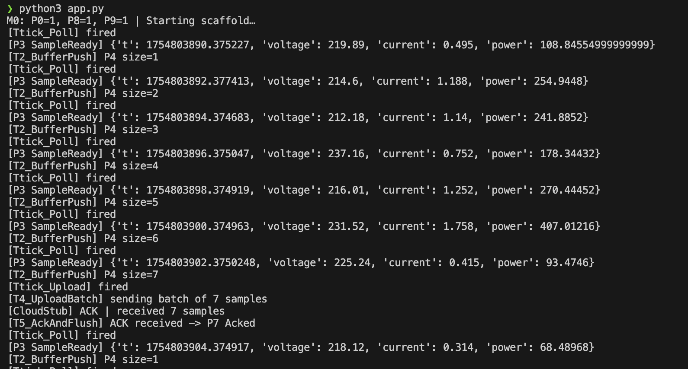

# EcoWatt Milestone 1 – Petri Net Model & Scaffold Implementation

This repository contains the **Milestone 1** deliverable for the EcoWatt project, featuring a **Petri Net system model** for periodic polling, buffering, and periodic upload functionality, along with a **Python scaffold implementation** that simulates device logic, inverter communication, and cloud connectivity.

## 📋 Overview

The system models a device that performs the following operations:

1. **Periodically polls** an inverter for voltage and current readings
2. **Buffers readings** locally using a bounded buffer
3. **Uploads** all buffered samples to the cloud every 15 seconds (simulated; 15 minutes in real device)
4. **Clears buffer** upon cloud acknowledgment
5. **Handles transient faults** such as inverter unavailability and cloud NACK responses

This design is captured in a **Petri Net model** for correctness verification and then implemented in a **Python scaffold** for simulation and testing.

## 📈 Petri Net Model

### Places (P)
- **P0** - Idle
- **P1** - PollTimerReady
- **P2** - Polling
- **P3** - SampleReady
- **P4** - Buffer [capacity=N]
- **P5** - UploadTimerReady
- **P6** - Uploading
- **P7** - Acked
- **P8** - PollTimerArmed
- **P9** - UploadTimerArmed

### Transitions (T)
- **T0** - ArmPollTimer
- **Ttick_Poll** - Timed transition (poll period)
- **T1** - DoPoll `{SIM_OK}`
- **T2** - BufferPush `{BUF_HAS_SPACE}`
- **T3** - ArmUploadTimer
- **Ttick_Upload** - Timed transition (upload period)
- **T4** - UploadBatch `{BUF_NOT_EMPTY}`
- **T5** - AckAndFlush

### Model Properties

The Petri Net ensures:
- **Boundedness**: Buffer never exceeds its defined capacity
- **Liveness**: With SIM & network operational, all buffered samples are eventually uploaded
- **Safety**: Guards prevent invalid state transitions

## 🗂 Project Structure

```
Python/
├── app.py                    # Main application runner, wires modules together
├── core/
│   ├── timers.py            # Periodic timers (poll/upload)
│   ├── acquisition.py       # Poll inverter + push to buffer
│   ├── buffer.py            # Bounded buffer (ring queue implementation)
│   └── uploader.py          # Upload to cloud + acknowledgment handling
├── sim/
│   ├── inverter_sim.py      # Simulated inverter readings (randomized V/I)
│   └── cloud_stub.py        # Simulated cloud service (ACK/NACK responses)
└── README.md
```

## ⚙️ Requirements

### Core Requirements
- **Python 3.8+**
- Standard library only (no external dependencies required)

### Optional Enhancements
For improved output formatting and type checking:
```bash
pip install rich mypy
```

## 🚀 Getting Started

### 1. Clone and Setup Environment
```bash
git clone https://github.com/yourusername/ecowatt_m1.git
cd ecowatt_m1
python3 -m venv .venv

# Activate virtual environment
# Linux/macOS:
source .venv/bin/activate
# Windows PowerShell:
# .venv\Scripts\Activate.ps1
```

### 2. Run the Application
```bash
python3 app.py
```

### 3. Understanding the Output

The application will display logs that directly map Petri Net transitions to code execution for full traceability:

- **Periodic polling**: `[Ttick_Poll]`, `[P3 SampleReady]`, `[T2_BufferPush]`
- **Upload cycles** (every 15 seconds): `[Ttick_Upload]`, `[T4_UploadBatch]`, cloud ACK/NACK responses, `[T5_AckAndFlush]`


*Figure 1: Simulation Log*

## 🔍 Key Features

- **Petri Net Traceability**: Every log message corresponds to a specific Petri Net transition
- **Fault Tolerance**: Handles inverter unavailability and cloud communication failures
- **Bounded Buffer**: Prevents memory overflow with configurable capacity limits
- **Periodic Operations**: Configurable timing for both polling and upload cycles
- **Simulation Environment**: Complete simulation of hardware and cloud components for testing

## 📝 Notes

- The upload period is set to 15 seconds for demonstration purposes (real device uses 15 minutes)
- All components are fully simulated, allowing for comprehensive testing without hardware dependencies
- The implementation maintains strict correspondence with the Petri Net model for verification purposes

