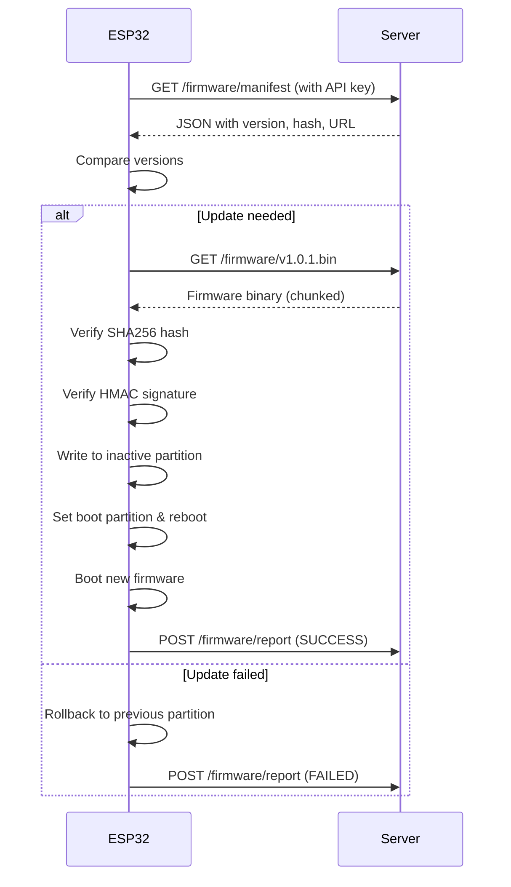

# ESP32 Secure OTA (Over-The-Air) Update System

A comprehensive, production-ready OTA firmware update system for ESP32 devices with advanced security features, rollback mechanisms, and comprehensive testing suite.

## 🎯 Overview

This system provides a secure, robust OTA update mechanism that includes:

- **🔐 Security**: Pre-shared API keys, HMAC firmware signing, SHA256 validation, HTTPS with certificates
- **🔄 Rollback**: Dual partition support with automatic rollback on failure
- **🛡️ Resilience**: Chunked downloads, network retry logic, memory management
- **🧪 Testing**: Comprehensive error simulation and validation suite
- **📊 Monitoring**: Detailed logging and status reporting

## 📁 Project Structure

```
OTA_ESP32/
├── 📄 platformio.ini          # PlatformIO configuration
├── 📄 partitions.csv          # Custom partition table for dual OTA
├── 📄 requirements.txt        # Python dependencies for server
├── 📄 ota_server.py           # Flask OTA server with security
├── 📄 README.md               # This documentation
├── 🔧 setup.sh                # Complete setup automation
├── 🔧 generate_certs.sh       # SSL certificate generation
├── 🔧 test_ota.sh            # Comprehensive OTA testing
├── 🔧 error_simulation.sh     # Error scenarios and rollback testing
├── 📂 include/
│   ├── config.h               # WiFi, server, and security configuration
│   └── security.h             # Cryptographic function declarations
├── 📂 src/
│   ├── main.cpp              # ESP32 OTA client implementation
│   └── security.cpp          # HMAC and crypto utilities
├── 📂 certs/                 # SSL certificates (generated)
├── 📂 firmware/              # Firmware binaries and manifests
└── 📂 logs/                  # Test and simulation logs
```

## 🚀 Quick Start

### Prerequisites

- **PlatformIO** installed and configured
- **Python 3.7+** with pip
- **OpenSSL** for certificate generation
- **ESP32** development board
- **WiFi network** for testing

### 1. Initial Setup

```bash
# Clone and navigate to project
cd OTA_ESP32

# Run complete setup (generates certificates, installs dependencies)
./setup.sh

# Make scripts executable (if needed)
chmod +x *.sh
```

### 2. Configure Network Settings

Edit `include/config.h`:

```cpp
// WiFi Configuration
#define WIFI_SSID "Your_WiFi_Network"
#define WIFI_PASSWORD "your_wifi_password"

// OTA Server Configuration  
#define OTA_SERVER_HOST "192.168.1.100"  // Your computer's IP
#define OTA_SERVER_PORT 5000

// Security Configuration
#define API_KEY "your-secret-api-key-change-this"
#define HMAC_SECRET_KEY "your-hmac-secret-key-change-this"
```

### 3. Build and Flash Initial Firmware

```bash
# Build the project
pio run

# Flash to ESP32
pio run --target upload

# Monitor serial output
pio device monitor
```

### 4. Start OTA Server

```bash
# Start the secure Flask server
python3 ota_server.py
```

### 5. Test OTA Updates

```bash
# Run comprehensive test suite
./test_ota.sh

# Or test specific scenarios
./error_simulation.sh
```

## 🔧 Detailed Configuration

### ESP32 Configuration (`include/config.h`)

```cpp
// Network Settings
#define WIFI_SSID "YourNetwork"
#define WIFI_PASSWORD "YourPassword"
#define OTA_SERVER_HOST "192.168.1.100"
#define OTA_SERVER_PORT 5000

// Security Keys (CHANGE THESE!)
#define API_KEY "your-unique-api-key-here"
#define HMAC_SECRET_KEY "your-unique-hmac-key-here"

// OTA Behavior
#define OTA_CHECK_INTERVAL 300000    // 5 minutes
#define MAX_DOWNLOAD_RETRIES 3
#define CHUNK_SIZE 1024
#define CONNECTION_TIMEOUT 30000

// Debug Settings
#define DEBUG_OTA 1
#define SERIAL_BAUDRATE 115200
```

### Server Configuration (`ota_server.py`)

The Flask server automatically:
- Serves firmware files securely over HTTPS
- Validates API keys on all requests  
- Generates HMAC signatures for firmware
- Provides manifest with version/hash information
- Logs all OTA activities and status reports

Key endpoints:
- `GET /firmware/manifest` - Returns latest firmware info
- `GET /firmware/<version>.bin` - Downloads firmware binary
- `POST /firmware/report` - Receives device status updates

## 🔐 Security Features

### 1. Authentication & Authorization
- **API Key Authentication**: All requests require valid API key header
- **HTTPS with Certificates**: Self-signed certificates for local development
- **Certificate Pinning**: ESP32 validates server certificate

### 2. Firmware Integrity
- **SHA256 Hashing**: Every firmware binary is hashed and verified
- **HMAC Signing**: Firmware signed with pre-shared secret key
- **Size Validation**: File size checks prevent oversized downloads

### 3. Secure Communication
- **TLS 1.2+**: All communication encrypted
- **Certificate Validation**: Server certificate must match expected CA
- **Request Validation**: Input sanitization and size limits

### 4. Rollback Protection
- **Dual Partitions**: ESP32 uses two firmware partitions
- **Automatic Rollback**: Reverts to previous version on failure
- **Boot Validation**: New firmware must confirm successful startup

## 🧪 Testing & Validation

### Automated Test Suite (`test_ota.sh`)

Runs comprehensive tests including:
- Normal OTA update flow
- API authentication security
- HTTPS certificate validation
- Network interruption handling
- Firmware corruption detection

```bash
# Run full test suite
./test_ota.sh

# Check test results
tail -f logs/test_results.log
```

### Error Simulation (`error_simulation.sh`)

Tests failure scenarios:
- Corrupted firmware binaries
- Wrong SHA256 hashes in manifest
- Network timeouts and interruptions
- Authentication bypass attempts
- Memory constraint handling
- Power loss simulation

```bash
# Interactive error simulation menu
./error_simulation.sh

# Run specific error test
./error_simulation.sh corrupt
./error_simulation.sh hash
./error_simulation.sh network
```

### Manual Testing Checklist

- [ ] Initial firmware flash and boot
- [ ] WiFi connection and server communication
- [ ] Successful OTA update with version increment
- [ ] Hash mismatch rejection
- [ ] Network interruption recovery
- [ ] Authentication failure handling
- [ ] Rollback on corrupted firmware
- [ ] Power loss during update (physical test)
- [ ] Memory constraint behavior
- [ ] Server certificate validation

## 📊 Monitoring & Debugging

### Serial Monitor Output

The ESP32 provides detailed logging:

```
[OTA] WiFi connected: 192.168.1.105
[OTA] Checking for updates...
[OTA] Current version: 1.0.0
[OTA] Server version: 1.0.1
[OTA] Update available, downloading...
[OTA] Download progress: 45%
[OTA] SHA256 verification: PASSED
[OTA] HMAC verification: PASSED
[OTA] Firmware written successfully
[OTA] Rebooting to new firmware...
```

### Server Logs

The Flask server logs all activities:

```
[2025-10-07 14:30:15] OTA request from 192.168.1.105
[2025-10-07 14:30:15] API key validated
[2025-10-07 14:30:15] Serving manifest v1.0.1
[2025-10-07 14:30:16] Firmware download started
[2025-10-07 14:30:18] Download completed successfully
[2025-10-07 14:30:25] Device reported: UPDATE_SUCCESS
```

## 🔄 Update Process Flow



## 🛠️ Development Workflow

### Building New Firmware

```bash
# 1. Update version in src/main.cpp
#define FIRMWARE_VERSION "1.0.2"

# 2. Build new firmware
pio run

# 3. Copy to firmware directory
cp .pio/build/esp32dev/firmware.bin firmware/firmware_v1.0.2.bin

# 4. Update server manifest (automatic in ota_server.py)
# 5. Test update process
./test_ota.sh
```

### Adding New Features

1. **Modify source code** in `src/` directory
2. **Update configuration** if needed in `include/config.h`
3. **Test locally** with simulation scripts
4. **Validate security** with error simulation suite
5. **Deploy** new firmware through OTA system

### Security Hardening for Production

1. **Generate proper certificates**: Replace self-signed certs with CA-signed
2. **Rotate keys regularly**: Update API keys and HMAC secrets
3. **Implement device-specific auth**: Add device ID validation
4. **Enable audit logging**: Log all OTA activities
5. **Monitor failure rates**: Track and alert on OTA failures
6. **Use secure key storage**: Store secrets in ESP32 NVS or secure element

## 🚨 Troubleshooting

### Common Issues

**ESP32 can't connect to WiFi:**
- Verify SSID and password in `config.h`
- Check WiFi network availability
- Monitor serial output for connection errors

**Certificate validation fails:**
- Ensure certificates are properly generated
- Check server IP matches certificate
- Verify certificate content in `config.h`

**OTA update fails:**
- Check API key consistency
- Verify server is running and accessible
- Monitor server logs for errors
- Test with error simulation scripts

**Rollback not working:**
- Verify partition table is correct
- Check dual partition configuration
- Monitor boot process and partition switching

### Debug Commands

```bash
# Check ESP32 partition table
pio run --target erase
pio run --target upload

# Test server connectivity
curl -k -H "X-API-Key: your-key" https://localhost:5000/firmware/manifest

# Monitor server in debug mode
FLASK_DEBUG=1 python3 ota_server.py

# Check certificate validity
openssl x509 -in certs/server.crt -text -noout
```

## 📚 API Reference

### ESP32 Client Functions

```cpp
// Main OTA functions
bool checkForUpdates();
bool downloadAndInstallUpdate();
bool verifyFirmware(String hash, String hmac);
void rollbackToSafePartition();

// Security functions  
String calculateSHA256(uint8_t* data, size_t length);
bool verifyHMAC(uint8_t* data, size_t length, String expectedHMAC);
bool validateServerCertificate();

// Network functions
bool connectWiFi();
HTTPClient createSecureClient();
bool downloadChunk(int offset, int size);
```

### Server API Endpoints

**GET /firmware/manifest**
- **Headers**: `X-API-Key: <api-key>`
- **Response**: JSON with version, SHA256, URL, size
- **Status**: 200 (success), 401 (unauthorized)

**GET /firmware/<version>.bin**  
- **Headers**: `X-API-Key: <api-key>`
- **Response**: Binary firmware file
- **Status**: 200 (success), 404 (not found), 401 (unauthorized)

**POST /firmware/report**
- **Headers**: `X-API-Key: <api-key>`, `Content-Type: application/json`
- **Body**: `{"device_id": "...", "status": "SUCCESS|FAILED", "version": "...", "error": "..."}`
- **Response**: JSON acknowledgment
- **Status**: 200 (success), 400 (bad request), 401 (unauthorized)

## 🔮 Advanced Features

### Future Enhancements

- **Device fleet management**: Track multiple devices and their versions
- **Staged rollouts**: Deploy updates to device subsets
- **Delta updates**: Send only changed portions of firmware
- **Over-the-air configuration**: Update settings without firmware changes
- **Remote diagnostics**: Collect device health and performance data
- **A/B testing**: Deploy different firmware versions to test groups

### Integration Options

- **Cloud platforms**: AWS IoT, Azure IoT, Google Cloud IoT
- **CI/CD pipelines**: Automatic firmware builds and deployments
- **Monitoring tools**: Grafana, Prometheus, custom dashboards
- **Device management**: Integration with existing IoT platforms

## 🤝 Contributing

1. Fork the repository
2. Create feature branch (`git checkout -b feature/amazing-feature`)
3. Test thoroughly with provided test suites
4. Commit changes (`git commit -m 'Add amazing feature'`)
5. Push to branch (`git push origin feature/amazing-feature`)
6. Open Pull Request

## 📄 License

This project is licensed under the MIT License - see the [LICENSE](LICENSE) file for details.

## 🙏 Acknowledgments

- ESP32 community for excellent documentation and examples
- Flask community for lightweight web framework
- PlatformIO team for excellent development tools
- OpenSSL project for cryptographic functions

## 📞 Support

For questions, issues, or contributions:
- Open an issue in the repository
- Check troubleshooting section above
- Review test logs in `logs/` directory
- Run diagnostic scripts for debugging

---

**⚠️ Security Notice**: This implementation is designed for local development and testing. For production deployments, ensure proper certificate management, key rotation, and security audit procedures are in place.