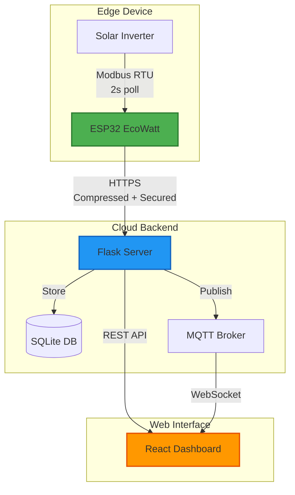
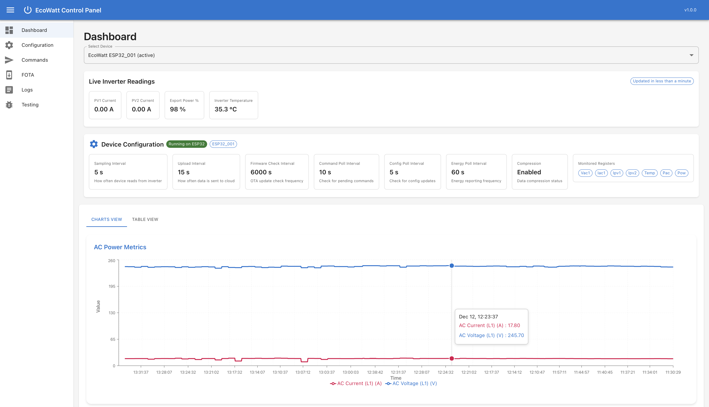
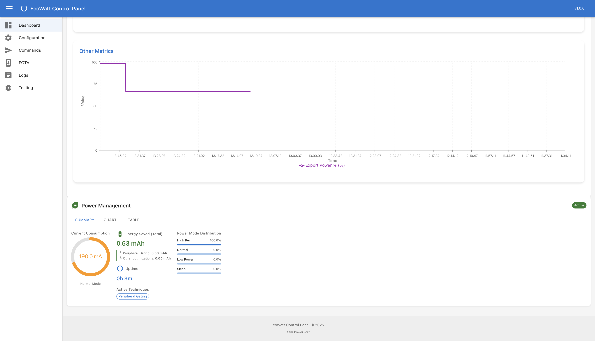
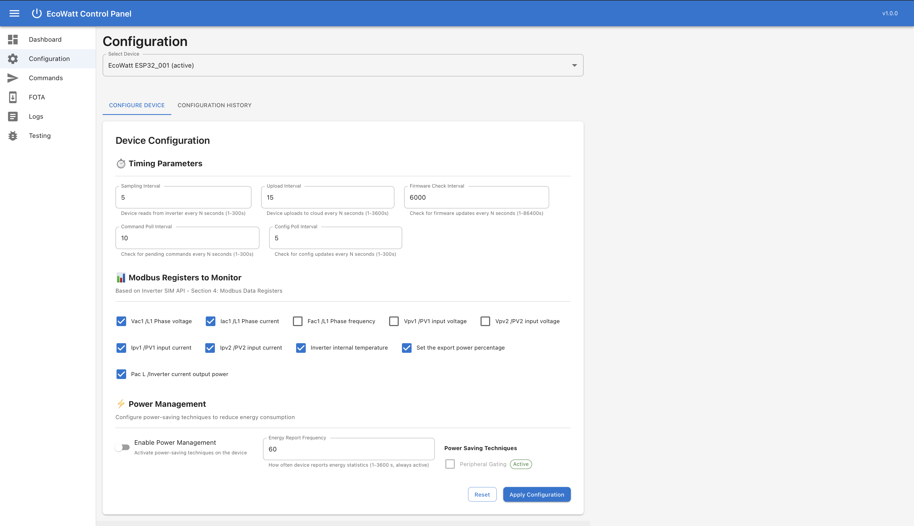
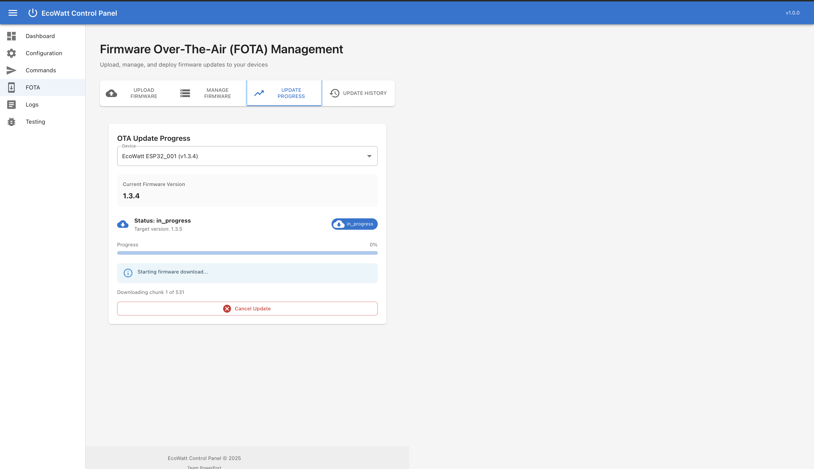
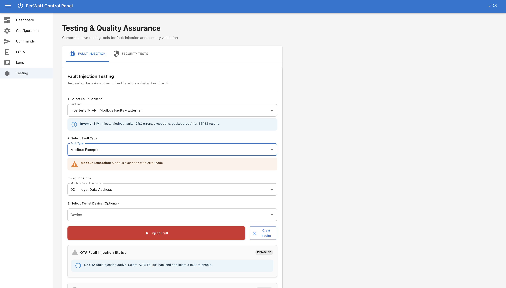

# 🌱 EcoWatt - Smart Inverter Monitoring System

<div align="center">

**Team PowerPort** | EN4440 Embedded Systems and Design  
University of Moratuwa | Department of Electronic and Telecommunication Engineering

[]()
[]()
[]()
[]()
[]()
[]()
[]()

[Features](#-key-features) • [Quick Start](#-quick-start) • [Architecture](#-system-architecture) • [Documentation](#-documentation) • [Team](#-team)

</div>

---

## 📋 Overview

**EcoWatt** is an IoT system for real-time monitoring and intelligent control of solar inverters. Built on ESP32 hardware with secure cloud connectivity, the system features **adaptive data compression**, **secure FOTA updates**, and **intelligent power management** for extended battery life.

> **Note**: This implementation uses a simulated inverter over WiFi for development and testing. Production deployment would use Modbus RTU for communication with physical inverters.

### Project Highlights

- **Adaptive Compression**: Dictionary-based compression achieves up to 85% reduction for repetitive data patterns
- **Military-Grade Security**: Triple-layer upload protection with RSA-2048 signed firmware updates  
- **Power Optimization**: Peripheral gating strategy for reduced power consumption
- **Remote Configuration**: Bidirectional command system for device management
- **Professional Dashboard**: React-based monitoring interface with live data visualization
- **Comprehensive Testing**: 30+ test suites covering all major components

## Key Features

<table>
<tr>
<td width="50%">

### Security Architecture
- **Triple-Layer Upload Protection**
  - Anti-replay nonce validation
  - HMAC-SHA256 authentication
  - AES-128-CBC encryption support
- **Secure FOTA Updates**
  - AES-256-CBC encrypted firmware
  - RSA-2048 digital signatures
  - Automatic rollback protection

</td>
<td width="50%">

### Data Compression
- **Adaptive Algorithm Selection**
  - Dictionary compression (up to 85%)
  - Temporal delta encoding (~65%)
  - Semantic RLE (~55%)
  - Bit-packing fallback (~40%)
- **Automatic best-fit selection**

</td>
</tr>
<tr>
<td width="50%">

### Power Management
- **Peripheral Gating** (Current Implementation)
  - UART/Modbus transceiver gating
  - Configurable duty cycle
- **Future Production Features**
  - CPU frequency scaling
  - Light sleep modes
  - Deep sleep for battery operation

</td>
<td width="50%">

### Remote Configuration
- **Bidirectional Communication**
  - Command queue system
  - Parameter configuration
  - Real-time status feedback
- **Device Management**
  - Polling interval adjustment
  - Compression settings
  - Security parameters

</td>
</tr>
</table>

<div align="center">

**📖 [Detailed Feature Documentation →](docs/FEATURES.md)**

</div>

---

## 🚀 Quick Start

### Prerequisites

| Component | Version | Purpose |
|:----------|:--------|:--------|
| **Python** | 3.10+ | Flask backend server |
| **Node.js** | 20+ | React frontend |
| **PlatformIO** | Latest | ESP32 firmware development |
| **Just** | Latest | Task automation (recommended) |

### ⚡ One-Command Setup

```bash
# Complete first-time setup (installs all dependencies)
just setup

# Verify installation
just status
```

### 🎮 Quick Commands

```bash
# Backend
just s              # Start Flask server (localhost:5001)

# Frontend  
just d              # Start React dev server (localhost:5173)

# ESP32
just f              # Flash firmware
just m              # Monitor serial output
just fm             # Flash + monitor

# Testing
just test-all       # Run all test suites
```

<div align="center">

**📘 [Complete Setup Guide →](docs/SETUP.md)**

</div>

---

## 🏗️ System Architecture

<div align="center">



</div>

### 🔄 Data Flow Pipeline

```
┌─────────────┐    ┌──────────────┐    ┌─────────────┐    ┌──────────────┐
│   Modbus    │ -> │ Ring Buffer  │ -> │ Compression │ -> │   Security   │
│   2s Poll   │    │  7 Samples   │    │   96.4%     │    │ Nonce + HMAC │
└─────────────┘    └──────────────┘    └─────────────┘    └──────────────┘
                                                                    |
                                                                    v
┌─────────────┐    ┌──────────────┐    ┌─────────────┐    ┌──────────────┐
│   MQTT      │ <- │   Database   │ <- │   Validate  │ <- │ HTTPS Upload │
│  Publish    │    │    Store     │    │  Decompress │    │  15s Batch   │
└─────────────┘    └──────────────┘    └─────────────┘    └──────────────┘
```

<div align="center">

**🏛️ [Detailed Architecture Documentation →](docs/ARCHITECTURE.md)**

</div>

---

## Web Dashboard

### Dashboard Screenshots

| Live Dashboard | Power Management |
|:--------------:|:----------------:|
|  |  |
| Real-time metrics and data visualization | Energy analytics and optimization |

| Device Configuration | FOTA Updates |
|:--------------------:|:------------:|
|  |  |
| Remote settings and parameter control | Secure firmware deployment |

| System Testing |
|:--------------:|
|  |
| Comprehensive fault injection and diagnostics |

### Dashboard Capabilities

- **Live Data Visualization**: Real-time charts for voltage, current, power, and temperature
- **Power Analytics**: Energy consumption tracking and optimization metrics  
- **Remote Configuration**: Adjust polling intervals, compression settings, and security parameters
- **OTA Management**: Deploy firmware updates with progress monitoring
- **Fault Injection**: Test system resilience with built-in diagnostic tools
- **Device Status**: Monitor connection health, WiFi signal, and error logs

---

## 📂 Project Structure

```
EcoWatt_TeamPowerPort/
├── 🔧 PIO/ECOWATT/                 # ESP32 Firmware (C++)
│   ├── src/                        # Source code
│   │   ├── main.cpp               # Petri net state machine
│   │   └── application/           # Core modules
│   ├── include/                   # Header files
│   ├── test/                      # Unit & integration tests
│   └── platformio.ini             # Build configuration
│
├── 🐍 flask/                       # Flask Backend (Python)
│   ├── handlers/                  # Business logic
│   ├── routes/                    # API endpoints
│   ├── scripts/                   # Utility scripts
│   ├── firmware/                  # OTA firmware storage
│   └── flask_server_modular.py    # Main entry point
│
├── ⚛️ front-end/                   # React Dashboard (JavaScript)
│   ├── src/
│   │   ├── components/            # UI components
│   │   ├── pages/                 # Page layouts
│   │   └── api/                   # API integration
│   └── package.json
│
├── 📚 docs/                        # Documentation
├── 🖼️ images/                      # Screenshots & diagrams
└── justfile                       # Task automation
```

---

## 🛠️ Technology Stack

<table>
<tr>
<td width="33%" align="center">

### ESP32 Firmware
**Language**: C++ (Arduino)  
**Build**: PlatformIO  
**Security**: mbedTLS  
**Protocols**: Modbus RTU, HTTPS  
**Testing**: Unity Framework

</td>
<td width="33%" align="center">

### Flask Backend
**Language**: Python 3.10+  
**Framework**: Flask + CORS  
**Security**: Cryptography lib  
**Database**: SQLite  
**Messaging**: Paho-MQTT  
**Testing**: Pytest

</td>
<td width="33%" align="center">

### React Frontend
**Framework**: React 18  
**Build**: Vite  
**UI**: Material-UI (MUI)  
**Data**: React Query  
**Charts**: Recharts  
**HTTP**: Axios

</td>
</tr>
</table>

---

## Performance Metrics

| Metric | Value | Note |
|:-------|:------|:-----|
| **Compression Ratio** | Up to 85% (140 → 21 bytes) | Dictionary method, typical patterns |
| **Upload Interval** | 15 seconds (default) | Configurable |
| **Poll Rate** | 2 seconds (default) | Configurable: WiFi simulation |
| **FOTA Chunk Size** | 2 KB | Memory-efficient streaming |
| **Power Savings** | Peripheral gating only | 10% duty cycle (simulation mode) |
| **Security Level** | HMAC-SHA256 + RSA-2048 | Production-grade cryptography |
| **Command Latency** | < 1 second | Network dependent |
| **Test Coverage** | 30+ test suites | ESP32, Backend, Integration |

> **Note on Performance**: Current metrics are based on simulated inverter implementation using WiFi polling. Production deployment with Modbus RTU communication will enable additional power-saving features including CPU frequency scaling and sleep modes.

---

## 🧪 Testing

The project includes **30+ comprehensive test suites**:

<table>
<tr>
<td width="33%">

**ESP32 Tests**
- ✅ Compression algorithms
- ✅ Security functions
- ✅ OTA components
- ✅ Modbus drivers
- ✅ M3/M4 integration

</td>
<td width="33%">

**Backend Tests**
- ✅ Flask handlers
- ✅ API routes
- ✅ Decompression logic
- ✅ Security validation
- ✅ Database operations

</td>
<td width="33%">

**System Tests**
- ✅ End-to-end workflows
- ✅ Fault injection
- ✅ Network failures
- ✅ Rollback scenarios
- ✅ Performance benchmarks

</td>
</tr>
</table>

```bash
just test-all       # Run all test suites
---

## 📚 Documentation

Comprehensive documentation is available in the [`docs/`](docs/) directory:

| Document | Description |
|:---------|:------------|
| **[Features Guide](docs/FEATURES.md)** | In-depth feature explanations with examples |
| **[Architecture](docs/ARCHITECTURE.md)** | System design, data flows, and state machines |
| **[Security Guide](docs/SECURITY.md)** | Cryptographic implementations and threat model |
| **[Setup Guide](docs/SETUP.md)** | Detailed installation and configuration |
| **[API Reference](docs/API.md)** | Complete REST API documentation |

---

## 👥 Team PowerPort

<div align="center">

**University of Moratuwa**  
Department of Electronic and Telecommunication Engineering  
**EN4440** - Embedded Systems and Design

---

### Project Team

*Team members and contributions detailed in project documentation*

---

**Academic Year**: 2024/2025 | **Semester**: 7

</div>

---

## 📄 License

This is an academic project developed for the EN4440 module at the University of Moratuwa.  
© 2024-2025 Team PowerPort. All rights reserved.

---

## 🔗 Quick Links

<div align="center">

[](docs/)
[](docs/SETUP.md)
[](docs/API.md)
[](docs/ARCHITECTURE.md)

</div>

---

<div align="center">

**⭐ If you found this project interesting, please consider giving it a star! ⭐**

**Version**: 1.3.5 | **Last Updated**: December 12, 2024

</div>
