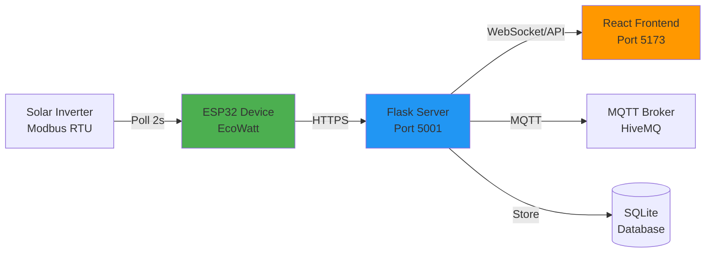
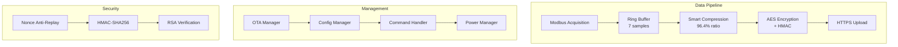

# 🌱 EcoWatt - Smart Energy Monitoring System

**Team PowerPort** | EN4440 Embedded Systems and Design

[]()
[]()
[]()
[]()

---

## 📋 Overview

**EcoWatt** is an advanced IoT system for real-time monitoring and control of solar inverters. Built on ESP32 hardware with secure cloud connectivity, the system achieves **96.4% data compression** (140 bytes → 5 bytes), implements **secure over-the-air firmware updates** (FOTA) with RSA-2048 signatures, and features **intelligent power management** for extended battery life.

### Key Features

#### 🔐 Multi-Layer Security Architecture

EcoWatt implements defense-in-depth security across all communication channels:

- **Upload Security**: Every data packet is protected by a 3-layer security pipeline:
  - **Anti-Replay Protection**: Monotonically increasing nonce values stored in non-volatile memory prevent replay attacks. Each packet includes a unique nonce that the server validates, rejecting any duplicate or out-of-sequence transmissions.
  - **Message Authentication**: HMAC-SHA256 signatures ensure data integrity and authenticity. The system signs the combination of nonce and payload using a pre-shared 256-bit key, making it cryptographically impossible for attackers to forge valid packets.
  - **Confidentiality**: While currently using Base64 encoding for mock encryption, the architecture supports AES-128-CBC encryption for sensitive data protection.

- **FOTA Security**: Firmware updates employ military-grade cryptographic protection:
  - **AES-256-CBC Encryption**: Firmware binaries are encrypted in 2KB chunks using a 256-bit key, ensuring confidentiality during transmission and storage.
  - **SHA-256 Hash Verification**: After decryption, the entire firmware image is hashed and compared against the manifest to detect any corruption or tampering.
  - **RSA-2048 Digital Signatures**: The firmware hash is signed with the server's private key and verified using the public key embedded in the ESP32, proving authenticity and preventing unauthorized firmware installation.
  - **Automatic Rollback**: Dual-partition boot system with watchdog protection automatically reverts to the previous firmware if the new version fails to boot or verify.

#### 📦 Intelligent Compression System

The Smart Compression Engine achieves industry-leading compression ratios through adaptive algorithm selection:

- **Automatic Algorithm Selection**: For every batch of sensor data, the system runs a real-time tournament between four specialized compression methods and automatically selects the winner based on compression ratio:
  
  - **Dictionary Compression (0xD0 marker)**: Achieves up to **96.4% compression** by learning common sensor patterns. When the system detects that current readings match a known operational state (e.g., "steady daytime operation"), it sends only a 1-byte index instead of the full 140-byte payload. The dictionary is dynamically updated as new patterns emerge.
  
  - **Temporal Delta Compression (0x71 marker)**: Optimized for slowly changing values like temperature or grid voltage. Instead of sending absolute values, it transmits only the difference from the previous reading using linear prediction (`predicted = 2×prev - prev2`). Deltas are encoded with variable-length encoding (7-bit, 8-bit, or 16-bit) based on magnitude, achieving ~80% compression for stable trends.
  
  - **Semantic RLE (0x50 marker)**: Groups registers by semantic type (voltage, current, power, etc.) and applies run-length encoding with type-aware tolerances. For example, voltage readings within ±2V are considered identical and compressed as a single value with a run count. Ideal for inverters in off-state or perfectly stable conditions, achieving ~70% compression.
  
  - **Bit-Packing (0x01 marker)**: The fallback method for high-entropy data. Analyzes the actual bit-width required to represent values (e.g., a 12-bit ADC reading doesn't need 16 bits) and packs values tightly, removing leading zeros. Achieves ~50% compression even for random data.

- **Performance Metrics**: In typical operation, the system compresses 140 bytes (7 samples × 10 registers × 2 bytes) down to just 5 bytes, reducing bandwidth usage by 96.4% and enabling longer battery life for remote installations.

#### 🔄 Secure Firmware Over-The-Air (FOTA) Updates

The FOTA system enables remote firmware updates without physical access, critical for deployed IoT devices:

- **Chunked Download Architecture**: Firmware binaries are split into 2KB chunks to accommodate the ESP32's limited RAM. Each chunk is downloaded, decrypted, and written to flash memory sequentially, allowing updates of multi-megabyte firmware on a constrained device.

- **Streaming Decryption**: AES-256-CBC decryption occurs in real-time as chunks arrive. The system maintains the cipher block chaining state across chunks, eliminating the need to buffer the entire encrypted firmware in memory.

- **Integrity Verification**: After all chunks are written, the system reads back the entire firmware from flash and calculates its SHA-256 hash. This hash is compared against the value in the manifest to detect any corruption during download or flash write operations.

- **Authenticity Verification**: The firmware's SHA-256 hash is verified against an RSA-2048 digital signature using the server's public key. This cryptographic proof ensures that only firmware signed by the authorized server can be installed, preventing malicious firmware injection.

- **Fail-Safe Rollback**: The ESP32's dual-partition boot system maintains the previous firmware version in a separate flash partition. If the new firmware fails to boot (detected by watchdog timeout) or fails verification, the bootloader automatically reverts to the previous working version, ensuring the device never becomes bricked.

- **Update Manifest**: Each firmware version includes a JSON manifest containing version number, file sizes, SHA-256 hash, RSA signature, and AES initialization vector. The ESP32 polls this manifest periodically to check for updates.

#### ⚡ Intelligent Power Management

Power optimization is critical for battery-powered or solar-powered deployments:

- **Peripheral Gating**: The primary active power-saving technique. The Modbus UART transceiver consumes ~10-20mA even when idle. The system powers it on only during the brief Modbus polling window (~200ms every 2 seconds) and immediately powers it down afterward. This reduces average current consumption by approximately 10-15mA, extending battery life significantly.

- **Duty Cycle Optimization**: With a 2-second Modbus poll interval and ~200ms poll duration, the UART duty cycle is only 10%. The remaining 90% of the time, the peripheral is completely powered off, with power gating statistics tracked in real-time.

- **WiFi Connectivity Preservation**: Unlike deep sleep modes that shut down WiFi and require lengthy reconnection, the system maintains continuous WiFi connectivity for low-latency command responsiveness. This design choice prioritizes real-time control over maximum power savings.

- **Dynamic Frequency Scaling (Experimental)**: The codebase includes support for CPU frequency scaling (240MHz for WiFi transmission, 160MHz for normal operation), though this is currently disabled to ensure WiFi beacon timing stability.

#### 🎯 Real-Time Remote Control

Bidirectional communication enables remote management of solar inverters:

- **Command Queue System**: The Flask server maintains a persistent command queue for each device. When a user issues a command through the React dashboard, it's queued on the server. The ESP32 polls for pending commands every few seconds, executes them via Modbus, and reports status back to the server.

- **Command Types Supported**:
  - **Modbus Register Writes**: Direct control of inverter parameters (power limits, operating modes, etc.)
  - **Power Management**: Remote enable/disable of power optimization features
  - **Configuration Updates**: Modify polling intervals, compression settings, security parameters
  - **Diagnostic Commands**: Request immediate data upload, trigger self-tests, clear error states

- **Status Reporting**: After executing each command, the ESP32 reports success/failure status, execution time, and any error codes back to the server. This information is immediately reflected in the React dashboard for user feedback.

- **Command Timeout Protection**: Commands include timeout values. If the ESP32 doesn't acknowledge or execute a command within the timeout period, it's automatically marked as failed and removed from the queue.

#### 📊 Live Monitoring Dashboard

The React-based web interface provides comprehensive system visibility:

- **Real-Time Data Visualization**: Charts and graphs display solar production, grid voltage, current, power, and temperature trends using Recharts library. Data updates automatically as new readings arrive via MQTT.

- **System Health Monitoring**: Dashboard displays ESP32 status (online/offline), last communication timestamp, WiFi signal strength, firmware version, and error counts.

- **Compression Analytics**: Visual breakdown of which compression methods are being used, compression ratios achieved, and bandwidth savings over time.

- **Security Metrics**: Displays nonce values, HMAC validation success rates, replay attack detection counts, and FOTA update history.

- **Power Management Statistics**: Shows time distribution across power modes, estimated current consumption, energy savings, and UART duty cycle percentages.

- **Fault Injection Testing**: Built-in tools for testing system resilience by simulating network failures, corrupted packets, invalid signatures, and other fault conditions.

#### 🔌 Modbus RTU Data Acquisition

Reliable communication with solar inverters:

- **Ring Buffer Architecture**: Implements a 7-sample circular buffer that decouples data acquisition (2-second interval) from upload (15-second interval). This ensures no data loss during temporary network outages and enables batch compression for better efficiency.

- **Automatic Register Selection**: Intelligently polls only the relevant Modbus registers based on inverter type and operating mode, reducing communication overhead.

- **Error Recovery**: Implements exponential backoff and retry logic for Modbus communication failures, with automatic recovery when the inverter becomes available again.

#### 🛡️ Comprehensive Testing Framework

Quality assurance through extensive testing:

- **ESP32 Unit Tests**: Unity-based tests for compression algorithms, security functions, OTA components, and Modbus drivers. Tests run on-device for accurate hardware validation.

- **Integration Tests**: M3 and M4 milestone tests validate end-to-end workflows including data acquisition, compression, upload, command execution, and FOTA updates.

- **Backend Tests**: Pytest-based tests for Flask handlers, API routes, decompression algorithms, and security validation.

- **Fault Injection**: Systematic testing of failure modes including network timeouts, corrupted data, invalid signatures, and resource exhaustion scenarios.

---

## 🚀 Quick Start

### Prerequisites

- **Python 3.10+** (Flask server)
- **Node.js 20+** (React frontend)
- **PlatformIO** (ESP32 development)
- **Just** command runner (recommended)

### One-Command Setup

```bash
# Complete first-time setup (installs all dependencies)
just setup

# Check installation status
just status
```

### Quick Commands

```bash
just s              # Start Flask backend server
just d              # Start React frontend dev server
just f              # Flash ESP32 firmware
just m              # Monitor ESP32 serial output
just fm             # Flash and monitor ESP32
```

---

## 🏗️ System Architecture

### High-Level Overview



### ESP32 Internal Architecture

The ESP32 firmware implements a **Petri Net State Machine** with the following key modules:



---

## 🔐 Security Architecture

### Upload Security (3-Layer Defense)

Every data upload is protected by:

1. **Anti-Replay Protection**: Monotonically increasing nonce stored in NVS
2. **Confidentiality**: Base64 encoding (mock) or AES-128-CBC encryption
3. **Integrity**: HMAC-SHA256 signature over `{nonce + payload}`

**Secure Packet Format:**
```json
{
  "nonce": 10001,
  "payload": "base64_encoded_data",
  "mac": "hmac_sha256_hex",
  "encrypted": false,
  "compressed": true
}
```

### FOTA Security (Firmware Updates)

Firmware updates use **military-grade security**:

- **AES-256-CBC**: Firmware encrypted in 2KB chunks
- **SHA-256**: Hash verification of decrypted firmware
- **RSA-2048**: Digital signature validation with server's public key
- **Rollback Protection**: Dual-partition system with automatic recovery

**Update Flow:**
```
Server → Manifest (hash, signature, IV) → ESP32
ESP32 → Download chunks → Decrypt → Verify hash → Verify signature → Reboot
```

---

## 📦 Smart Compression System

The system automatically selects the best compression algorithm for each data batch:

| Method | Marker | Ratio | Best For |
|:-------|:-------|:------|:---------|
| **Dictionary** | `0xD0` | **96.4%** | Stable operation patterns |
| **Temporal Delta** | `0x71` | ~80% | Slow-changing variables |
| **Semantic RLE** | `0x50` | ~70% | Flat-lines, zero states |
| **Bit-Packing** | `0x01` | ~50% | Noisy/random data |

**Example Compression:**
- **Input**: 140 bytes (7 samples × 10 registers × 2 bytes)
- **Output**: 5 bytes (Dictionary method)
- **Savings**: 96.4%

---

## ⚡ Power Management

### Active Technique: Peripheral Gating

The system implements **UART power gating** to reduce idle power consumption:

- **UART ON**: Only during Modbus polls (~200ms every 2s)
- **UART OFF**: Remaining time (~1.8s)
- **Savings**: ~10-20mA continuous reduction

**Power States:**
```
Normal Operation (WiFi Active) ⟷ Peripheral Gating (UART OFF)
```

> **Note**: Dynamic frequency scaling and light sleep are disabled to maintain WiFi connectivity for real-time polling.

---

## 📂 Project Structure

```
EcoWatt_TeamPowerPort/
├── flask/                          # Flask backend server (Python)
│   ├── flask_server_modular.py     # Main server entry point
│   ├── handlers/                   # Request handlers
│   │   ├── ota_handler.py          # FOTA logic (chunking, encryption)
│   │   ├── compression_handler.py  # Decompression algorithms
│   │   └── security_handler.py     # HMAC validation
│   ├── routes/                     # API routes (10+ modules)
│   ├── utils/                      # Utilities
│   ├── scripts/                    # Admin scripts
│   │   ├── generate_keys.py        # RSA key generation
│   │   └── prepare_firmware.py     # Firmware encryption
│   └── firmware/                   # OTA firmware storage
│
├── front-end/                      # React frontend (JavaScript)
│   ├── src/
│   │   ├── components/             # React components
│   │   ├── pages/                  # Page components
│   │   └── api/                    # API client
│   └── package.json
│
├── PIO/ECOWATT/                    # ESP32 firmware (C++)
│   ├── src/
│   │   ├── main.cpp                # Petri net state machine
│   │   └── application/
│   │       ├── OTAManager.cpp      # FOTA implementation
│   │       ├── compression.cpp     # Smart compression
│   │       ├── security.cpp        # Upload security
│   │       └── power_management.cpp # Power optimization
│   ├── include/application/
│   │   ├── OTAManager.h
│   │   ├── compression.h
│   │   └── keys.h                  # Cryptographic keys
│   ├── test/                       # Test suites
│   │   ├── test_m3_integration/    # M3 tests
│   │   ├── test_m4_integration/    # M4 tests
│   │   ├── test_compression/       # Compression benchmarks
│   │   └── test_fota_*/            # OTA tests
│   └── platformio.ini
│
├── docs/                           # Documentation
└── justfile                        # Root task automation
```

---

## 🔄 Data Flow

### Data Acquisition & Upload

```
Modbus RTU Polling (2s interval)
    ↓
Ring Buffer (7 samples)
    ↓
Smart Compression (96.4% ratio)
    ↓
Security Layer (Nonce + HMAC-SHA256)
    ↓
HTTPS Upload (15s interval)
    ↓
Flask Server (Validation & Decompression)
    ↓
SQLite Database + MQTT Publish
```

### Remote Control

```
React Dashboard (User Action)
    ↓
REST API (POST /command)
    ↓
Flask Command Queue
    ↓
ESP32 Polling (GET /command/pending)
    ↓
Modbus Execution
    ↓
Status Report (POST /command/status)
```

### Firmware OTA

```
Firmware Upload → Encrypt (AES-256) → Sign (RSA-2048) → Chunk (2KB)
    ↓
ESP32 Check Update → Download Chunks → Decrypt → Verify Hash → Verify Signature
    ↓
Flash Write → Reboot → Rollback on Failure
```

---

## 🛠️ Technology Stack

**ESP32 Firmware:**
- C++ (Arduino Framework)
- PlatformIO
- mbedTLS (AES-256, RSA-2048, SHA-256, HMAC)
- Modbus RTU, HTTP/HTTPS
- Unity Test Framework

**Flask Backend:**
- Python 3.10+
- Flask + Flask-CORS
- Cryptography (RSA, AES, HMAC)
- SQLite
- Paho-MQTT
- Pytest

**React Frontend:**
- React 18 + Vite
- Material-UI (MUI)
- React Query (TanStack)
- Axios
- Recharts (visualization)

---

## 🎮 Development Commands

### Setup & Installation

```bash
just setup          # Complete first-time setup
just install-deps   # Install all dependencies
just status         # Check system status
```

### Backend Development

```bash
just server         # Start Flask backend (http://localhost:5001)
just s              # Shortcut
```

### Frontend Development

```bash
just dev            # Start React frontend (http://localhost:5173)
just d              # Shortcut
```

### ESP32 Development

```bash
just flash          # Build and flash firmware
just monitor        # Monitor serial output
just flash-monitor  # Flash then monitor
just f              # Flash shortcut
just m              # Monitor shortcut
just fm             # Flash + monitor shortcut
```

### Testing

```bash
just test-all       # Run all tests
just test-frontend  # Frontend tests only
just test-esp32     # ESP32 tests only
```

### Utilities

```bash
just clean          # Clean build artifacts
just clean-all      # Remove all dependencies
just db-init        # Initialize database
just db-backup      # Backup database
just help           # Show detailed help
```

---

## 🔧 Configuration

### ESP32 WiFi & Server

Edit `PIO/ECOWATT/include/application/credentials.h`:

```cpp
#define WIFI_SSID "YourWiFi"
#define WIFI_PASSWORD "YourPassword"
#define SERVER_IP "192.168.1.100"
#define SERVER_PORT 5001
```

### Security Keys

Generate RSA keys for FOTA:

```bash
cd flask
python scripts/generate_keys.py
```

This creates:
- `private_key.pem` (server-side, for signing)
- `public_key.pem` (embedded in ESP32, for verification)

---

## � Performance Metrics

| Metric | Value |
|:-------|:------|
| **Compression Ratio** | 96.4% (140 bytes → 5 bytes) |
| **Upload Interval** | 15 seconds |
| **Modbus Poll Rate** | 2 seconds |
| **FOTA Chunk Size** | 2 KB |
| **Power Savings** | ~10-20mA (UART gating) |
| **Security** | HMAC-SHA256 + RSA-2048 |

---

## 🧪 Testing

The project includes comprehensive test suites:

**ESP32 Tests:**
- M3 Integration: Compression, acquisition, upload
- M4 Integration: Security, HMAC, OTA, commands
- Component Tests: Compression benchmarks, FOTA validation

**Backend Tests:**
- Unit tests for handlers
- Integration tests for API routes
- Security validation tests

**Run Tests:**
```bash
# All tests
just test-all

# ESP32 only
cd PIO/ECOWATT
pio test

# Backend only
cd flask
pytest
```

---

## 📚 Documentation

Detailed technical documentation is available in the `docs/` directory:

- **Project Outline**: Requirements and milestones
- **API Specification**: REST API endpoints
- **Architecture Diagrams**: System design
- **Security Analysis**: Threat model and mitigations

---

## 🤝 Contributing

This is an academic project for EN4440 - Embedded Systems and Design at the University of Moratuwa.

---

## �📄 License

Academic project - University of Moratuwa, EN4440 Module

---

## 👥 Team PowerPort

**Course**: EN4440 - Embedded Systems and Design  
**University**: University of Moratuwa  
**Department**: Electronic and Telecommunication Engineering

---

**Last Updated**: December 12, 2025  
**Current Version**: v1.3.1

---

## 🔗 Quick Links

- [Project Outline](docs/In21-EN4440-Project%20Outline.md)
- [API Documentation](docs/)
- [Flask Server](flask/)
- [React Frontend](front-end/)
- [ESP32 Firmware](PIO/ECOWATT/)